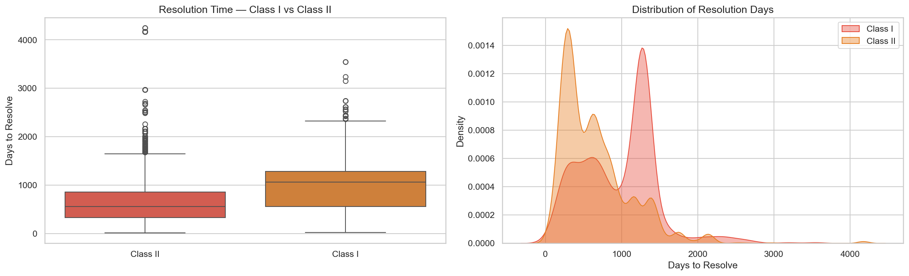
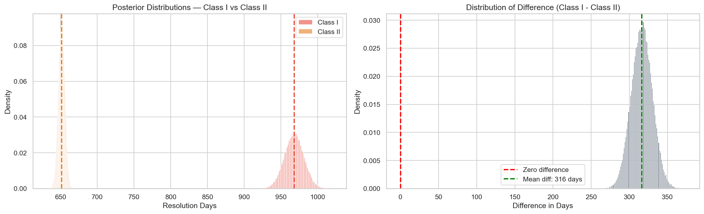
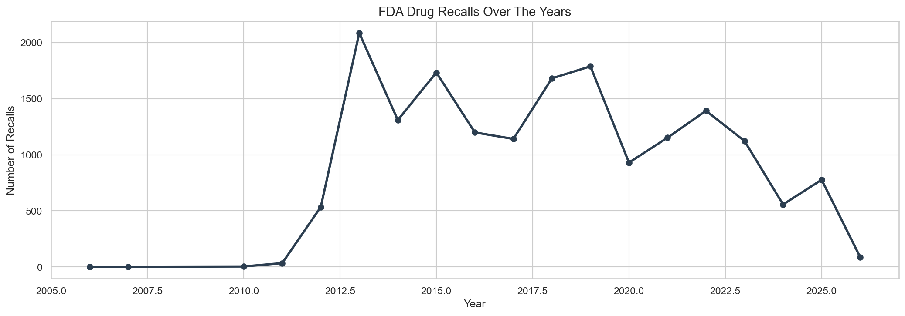

# FDA Drug Recall A/B Testing Analysis


---

## Where This Started

Honestly, I stumbled into this question while browsing through FDA enforcement data. 
I assumed the most dangerous drug recalls — the ones that can actually kill someone — 
would be treated with the most urgency. Get them off shelves fast, close the case, 
move on.

The data said otherwise.

That gap bothered me enough to actually test it.

---

## What The Data Showed

Class I recalls — FDA's most severe category, reserved for products that could cause 
serious harm or death — take nearly **a full year longer** to resolve than Class II recalls.

Not a little longer. 316 days longer on average.

| | Days |
|---|---|
| Class I average | 968 days |
| Class II average | 651 days |
| Gap | **316 days** |

I ran this through both Frequentist and Bayesian testing to make sure I wasn't 
just seeing noise. I wasn't.

- P-value came back essentially zero
- Bayesian model put the probability of this being a real difference at 100%
- The 95% confidence interval never dipped below 289 days

This isn't a close call. The difference is real, it's large, and it's consistent.

---

## Final Summary Dashboard


---

## Resolution Time — Class I vs Class II



---

## Bayesian Posterior Distributions



---

## Recalls Over Time



---

## Why Does This Happen?

This is where it gets interesting. The obvious assumption is that someone 
is dropping the ball on the dangerous ones. But I don't think that's it.

Class I cases are harder to close — not because of negligence, but because 
of what closing them actually requires:

- Deeper FDA investigation into root cause
- More extensive legal and regulatory review
- Higher burden of proof before a case gets terminated
- Greater scrutiny on whether the firm has actually fixed the problem

The FDA doesn't just take a company's word for it when lives are at stake. 
That extra caution takes time. And the data reflects that.

---

## What This Means For The Industry

Right now there's no public benchmark for how long a recall should take. 
Companies don't get penalized for dragging their feet through a Class I case 
as long as they're technically in compliance.

That needs to change.

A few things that would actually move the needle:

**Set resolution time targets by class** — Class I cases should have a hard 
ceiling. 500 days maximum. Right now there's no such standard and some cases 
in this dataset ran past 4,000 days.

**Flag repeat offenders early** — some firms in this data show up over and 
over. That pattern deserves regulatory attention before the next recall happens, 
not after.

**Separate complexity from delay** — not every long Class I case is slow because 
it's complicated. Some of them are just slow. Those two situations need to be 
treated differently.

---

## What I Would Tell The FDA

The length of a recall shouldn't be treated as a neutral outcome. 
Every extra day a dangerous drug stays in circulation — or that a firm 
operates under the cloud of an unresolved recall — is a cost that someone 
is paying. Usually patients.

316 days is not a rounding error. It's a systemic pattern. 
And systemic patterns have systemic fixes.

---

## How The Analysis Was Done

Five notebooks, each with a single job:

| Notebook | Purpose |
|---|---|
| `01_EDA.ipynb` | Understanding the raw data before touching it |
| `02_cleaning.ipynb` | Fixing dates, dropping noise, building the resolution_days metric |
| `03_frequentist.ipynb` | Z-test, p-value, confidence interval, power analysis |
| `04_bayesian.ipynb` | Posterior distributions, Monte Carlo sampling, credible interval |
| `05_summary.ipynb` | Pulling both methods together into one clear answer |

---

## On Using Two Statistical Methods

I ran both Frequentist and Bayesian analysis on purpose — not to pad the project 
but because they answer slightly different questions.

Frequentist tells you whether the difference is statistically significant. 
Bayesian tells you how confident you should actually be that one group is 
different from the other.

When both methods point to the same answer that strongly, 
the result is hard to argue with.

---

## Limitations

Worth being upfront about:

- Only resolved recalls are in scope — cases still ongoing have no end date 
  so they can't be included in resolution time analysis
- This is observational — the data shows a difference but can't fully explain 
  why it exists
- 2026 data is partial — the year isn't over

---

## Running This Yourself
```bash
git clone https://github.com/AnithaMorampudi/FDA-Drug-Recall-A-B-Testing.git
cd FDA-Drug-Recall-A-B-Testing
pip install -r requirements.txt
jupyter notebook
```

Notebooks run in order: `01` → `02` → `03` → `04` → `05`

---

## Data

Everything here uses real FDA enforcement data pulled directly from the OpenFDA API. 
17,529 records covering 2006 through early 2026. No synthetic data.

🔗 [open.fda.gov/apis/drug/enforcement](https://open.fda.gov/apis/drug/enforcement/)

---

## Tools Used

Python · Pandas · NumPy · SciPy · Matplotlib · Seaborn · Statsmodels · Jupyter

---

*Built by Anitha Morampudi*
🔗 [GitHub](https://github.com/AnithaMorampudi)
